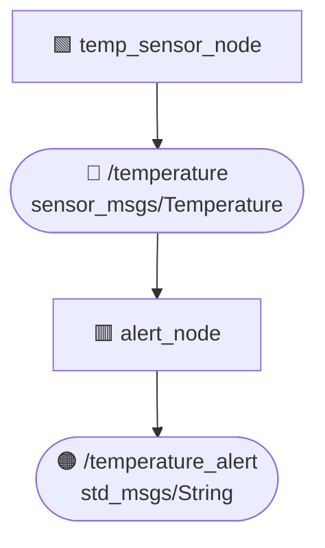

# jan_fwl

Ez a ROS 2 package két node-ot tartalmaz:

- **temp_sensor_node**: Szimulált hőmérséklet értékeket generál (20.0–40.0 °C között), és elküldi a `temperature` nevű topicra.
- **alert_node**: Figyeli a `temperature` topicot, és ha az érték meghaladja a 30.0 °C-ot, akkor egy riasztást publikál `temperature_alert` topicon.

## Követelmények

- ROS 2 Humble
- Python 3
- A `sensor_msgs` és `std_msgs` csomagok

## Telepítés és build

```bash
cd ~/ros2_ws/src
git clone <https://github.com/PeterJanosi/jan_fwl>
cd ~/ros2_ws
colcon build --packages-select jan_fwl
source install/setup.bash
```
## Futtatás
### Két külön Terminálban

```bash
#Terminál 1 - Temp_sensor_node
ros2 run jan_fwl temp_sensor_node
```

```bash
# Terminál 2 - Alert node
ros2 run jan_fwl alert_node
```
### VAGY launch fájllal együtt:
```
ros2 launch jan_fwl monitor.launch.py
```

A launch fájl a launch/monitor.launch.py útvonalon található, és a következő node-okat indítja:
 - temp_sensor_node (név: temp_sensor)
- alert_node
## Topic kapcsolatok
| Node             | Topic                | Típus                         | I/O          |
| ---------------- | -------------------- | ----------------------------- | ------------ |
| temp_sensor_node | `/temperature`       | `sensor_msgs/msg/Temperature` | Publikál     |
| alert_node       | `/temperature`       | `sensor_msgs/msg/Temperature` | Feliratkozik |
| alert_node       | `/temperature_alert` | `std_msgs/msg/String`         | Publikál     |
<details>
<summary>📊 Kattints a node-topic gráf megtekintéséhez</summary>


</details> 

## Kimeneti Példa
- [INFO] [temp_sensor_node]: Published temperature: 33.21 °C

- [WARN] [alert_node]: ⚠️ High temperature alert: 33.21 °C
## Szerző
- Név: [Jánosi Péter]
- Neptun: [FWLFEQ]
